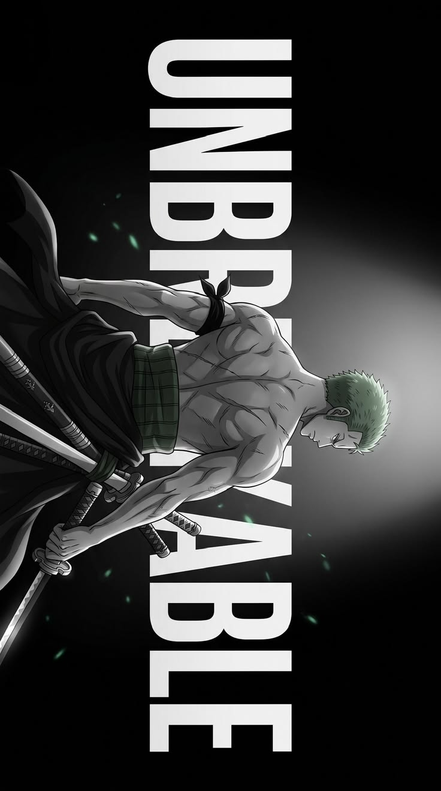

  

# 💫 About Me: 

I'm a B.Tech Computer Science Engineering student, graduating in 2029, interested in building practical software and understanding how things work under the hood.  I enjoy turning ideas into working projects — from AI and computer vision systems to Python utilities, web applications, automation tools, and developer-focused projects.

## 🌐 Socials:
   

# 💻 Tech Stack:
                

### 📊 GitHub Stats

| Total Contributions | Current Streak | Longest Streak |
|:---:|:---:|:---:|
| **8** Nov 10, 2025 – Present | 🔥 **1** Sep 24 | **2** Nov 20 – Nov 21, 2025 |

 

### 🍕 Random Dev Quote

> *"Hardware is the part you can replace. Software is the part you have to keep, because it's so expensive and nobody understands it any more."*
> — *Jim Horning*

<!-- Proudly created with GPRM ( https://gprm.itsvg.in ) -->
